# TrustCart

### AI-Powered Online Grocery Shopping with Seller Trust Score

TrustCart is a full-stack online grocery marketplace that brings **customers, sellers, delivery partners, and admins** together in one platform.

The main feature of the project is the **Seller Trust Score**, which uses seller verification, ratings, reviews, and complaint-related data to give customers a clearer idea of seller reliability.

---

## Features

### Customer

- Register and login
- Browse and search grocery products
- View product details and ratings
- Add products to cart
- Manage delivery addresses
- Place orders
- Make online payments
- Track order status
- Submit ratings and reviews
- View Seller Trust Score and AI Trust Summary

### Seller

- Seller registration and login
- Add, edit, and manage products
- Manage inventory
- Manage incoming orders
- View sales information
- View customer reviews
- View Seller Trust Score and its factors

### Delivery Partner

- Delivery partner login
- View assigned orders
- Update delivery status
- Share delivery location
- Confirm successful delivery

### Admin

- Admin dashboard
- Manage users
- Verify and manage sellers
- Manage products
- Monitor orders
- Manage delivery partners
- Manage reviews
- View platform reports

---

## Seller Trust Score

The **Seller Trust Score** is the defining feature of TrustCart.

The Trust Engine considers factors such as:

- Seller verification
- Customer ratings
- Review sentiment
- Complaint history
- Seller performance data

The system generates a **Trust Score** along with an **AI Trust Summary**. The score is visible to customers while browsing products and is also available to sellers and admins.

---

## System Architecture

TrustCart follows a layered architecture with a **React.js presentation layer, Node.js/Express application layer, and MongoDB data layer**.

The **AI Seller Trust Engine** works with seller verification and review-related data, while **Razorpay and Cloudinary** are used as external integrations.

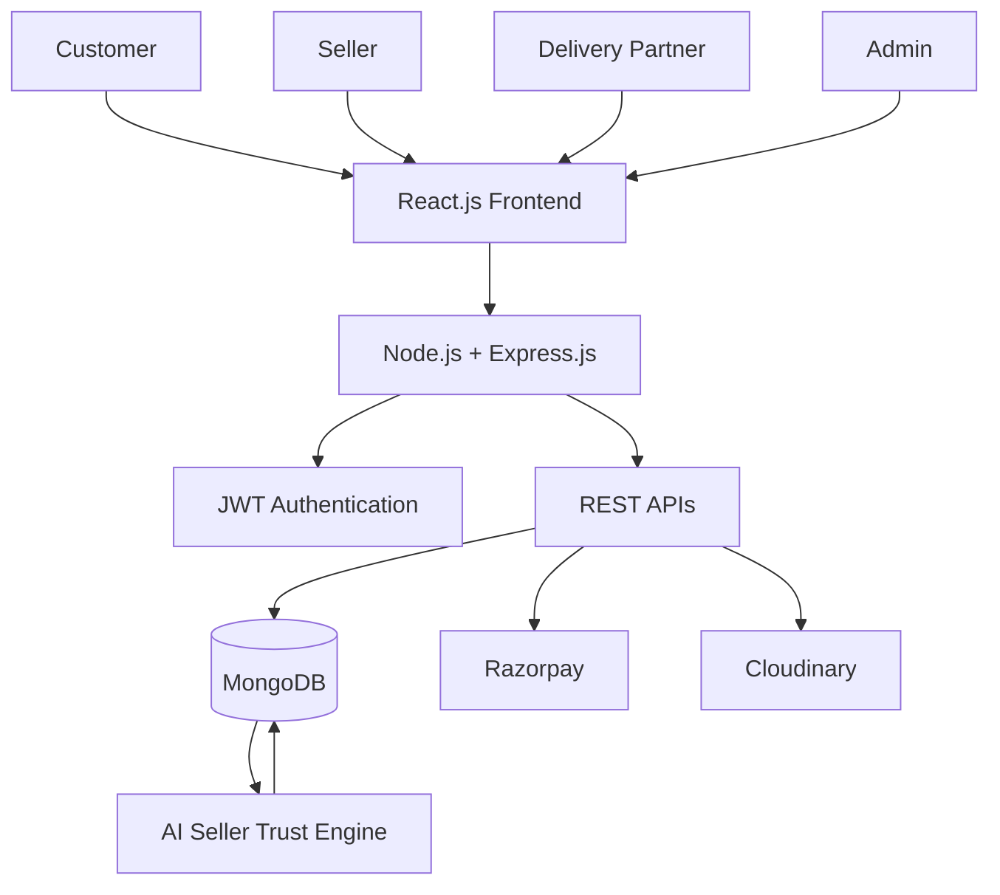

---

## Use Case Diagram

The system has four main roles: **User, Seller, Delivery Partner, and Admin**. Each role has its own set of functions within the platform.

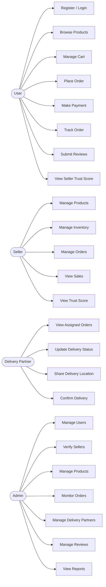

---

## Database Design

The main entities represented in the project are:

- User
- Seller
- Product
- Order
- Review
- Delivery
- SellerTrust

The relationships include:

- User-to-Order
- Seller-to-Product
- Product-to-Review
- Seller-to-SellerTrust
- Order-to-Delivery

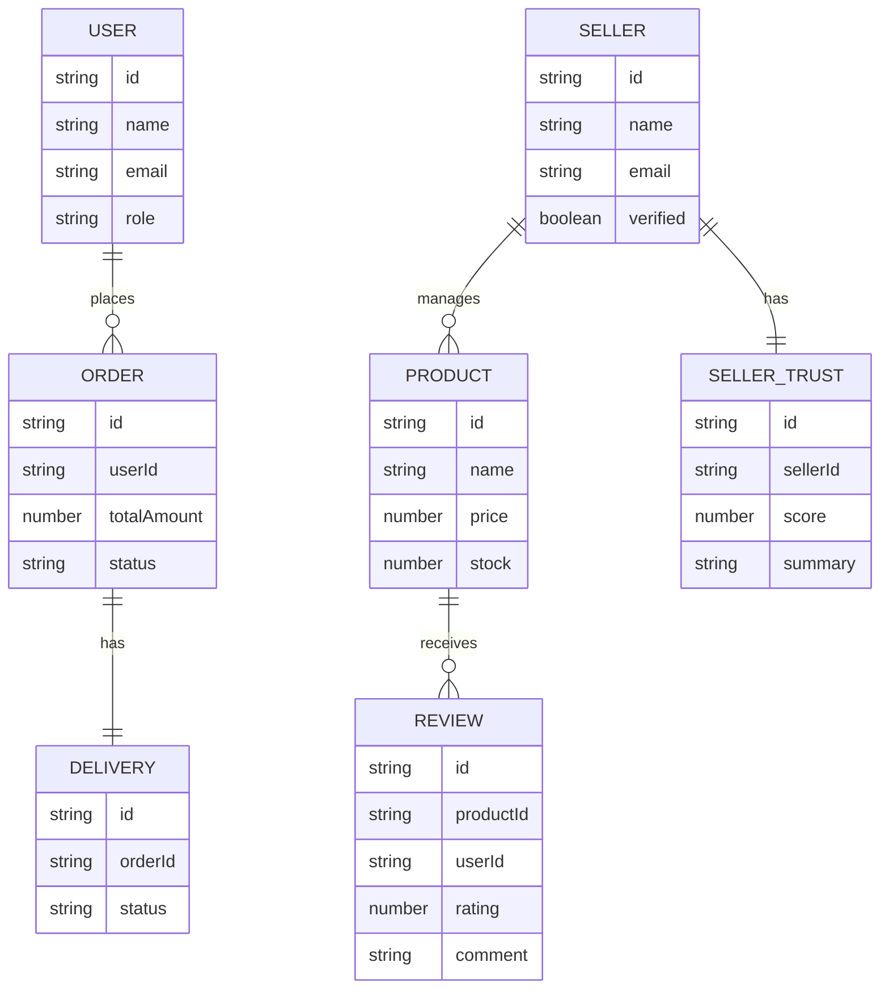

---

## Data Flow Diagrams

### Level 0 DFD

The Level 0 DFD represents TrustCart as a single system and shows its interaction with the **User, Seller, Delivery Partner, Admin, and Payment Gateway**.

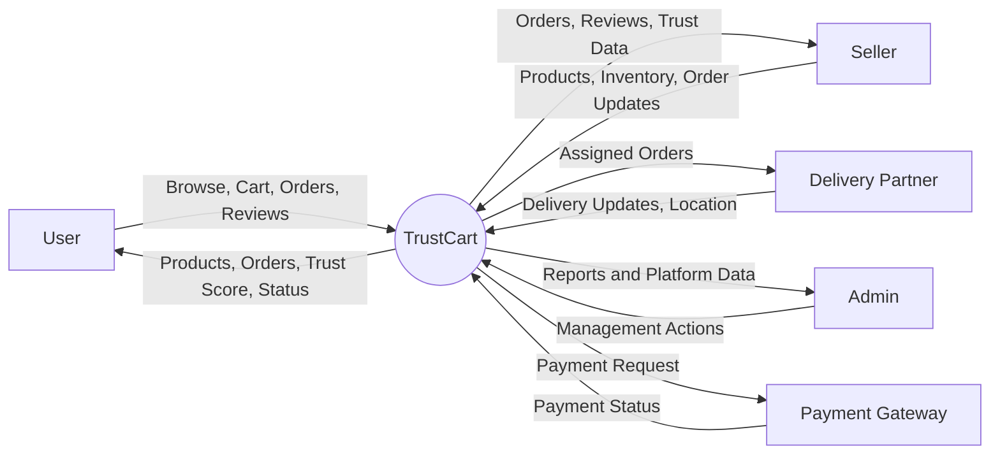

### Level 1 DFD

The Level 1 DFD breaks the system into its major processes, including **user management, product management, cart and order management, payment processing, seller management, delivery management, review and trust management, and admin management**.

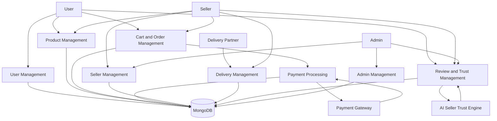

---

## Application Flow

```text
Customer
   |
   v
Browse Products -> Product Details -> Cart -> Checkout -> Payment
                                                         |
                                                         v
                                                       Order
                                                         |
                    +------------------------------------+------------------+
                    |                                                       |
                    v                                                       v
                 Seller                                             Delivery Partner
                    |                                                       |
             Manage Order                                          Update Status
                    |                                                       |
                    +-------------------------+-----------------------------+
                                              |
                                              v
                                       Order Delivered


Customer Reviews + Seller Verification + Complaint/Performance Data
                              |
                              v
                       AI Trust Engine
                              |
                              v
                    Seller Trust Score
                              |
                              v
                      Customer Product View
```

---

## Technology Stack

| Layer | Technology |
|---|---|
| Frontend | React.js |
| Backend | Node.js, Express.js |
| Database | MongoDB |
| Authentication | JWT |
| AI | Custom AI/ML Trust Engine |
| Payment | Razorpay |
| Media Storage | Cloudinary |

---

## API Structure

The project uses REST APIs for the main application modules.

```text
/api/auth
/api/users
/api/sellers
/api/products
/api/orders
/api/payments
/api/delivery
```

Authentication is handled using **JWT tokens and role-based access control** across the four user roles.

---

## Project Structure

```text
TrustCart/
│
├── client/                         # React frontend
│   └── src/
│       ├── components/
│       ├── pages/
│       └── ...
│
├── server/                         # Node.js + Express backend
│   ├── controllers/
│   ├── middleware/
│   ├── models/
│   ├── routes/
│   ├── services/
│   ├── socket/
│   └── utils/
│
├── screenshots/                    # Project screenshots
│   ├── customer-home.png
│   ├── products.png
│   ├── product-details.png
│   ├── checkout-payment.png
│   ├── seller-dashboard.png
│   ├── seller-trust-score.png
│   ├── admin-dashboard.png
│   ├── admin-seller-management.png
│   └── delivery-dashboard.png
│
└── README.md
```

---

## Getting Started

### 1. Clone the Repository

```bash
git clone <your-repository-url>
cd TrustCart
```

### 2. Start the Backend

```bash
cd server
npm install
npm run dev
```

### 3. Start the Frontend

Open another terminal:

```bash
cd client
npm install
npm run dev
```

---

## Screenshots

### Customer Interface

#### Home Page

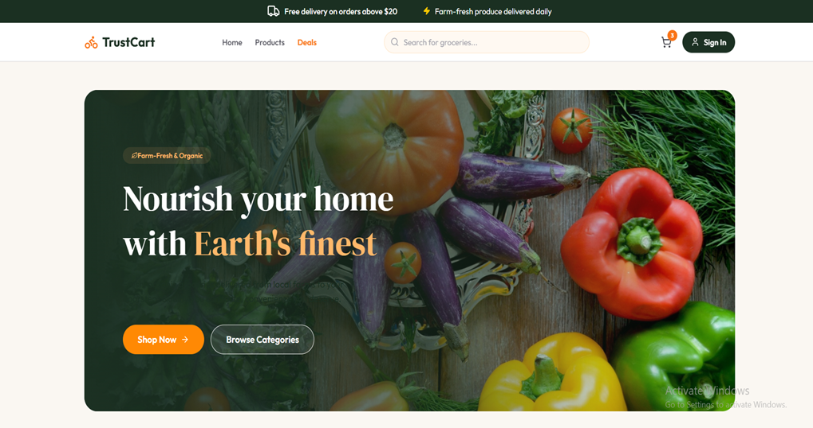

#### Products

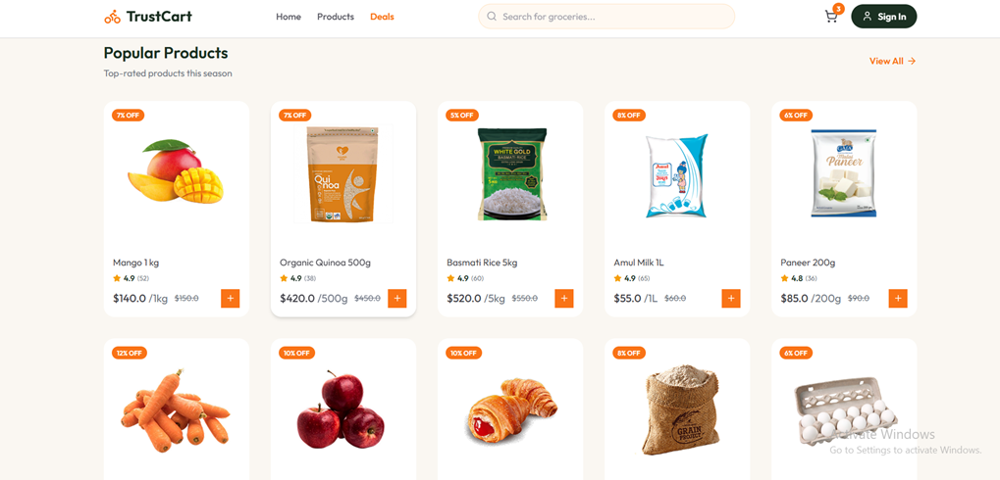

#### Product Details

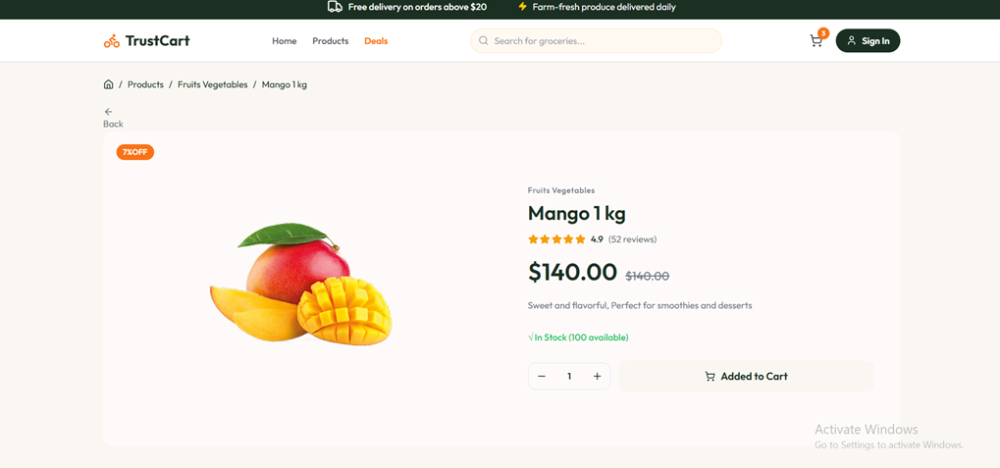

#### Checkout & Payment

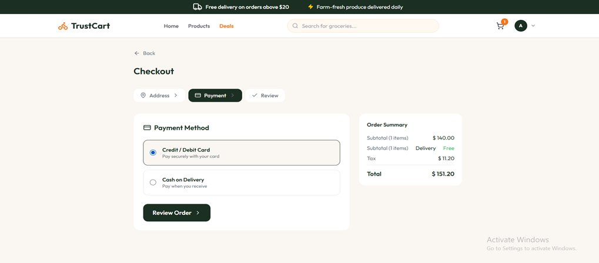

---

### Seller Interface

#### Seller Dashboard

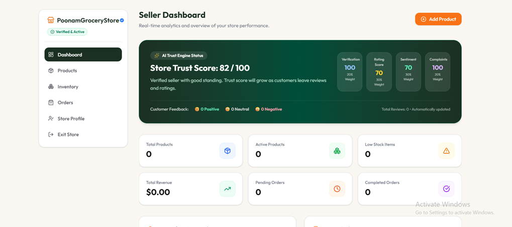

#### Seller Trust Score

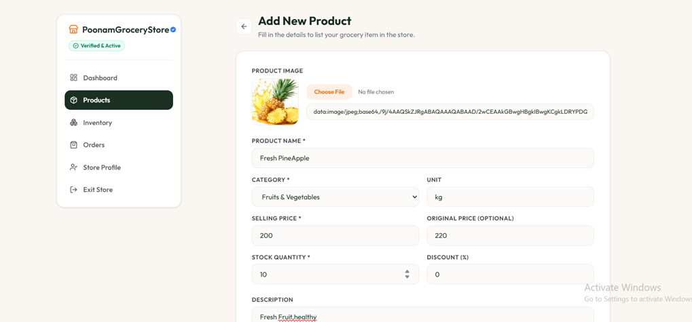

---

### Admin Interface

#### Admin Dashboard

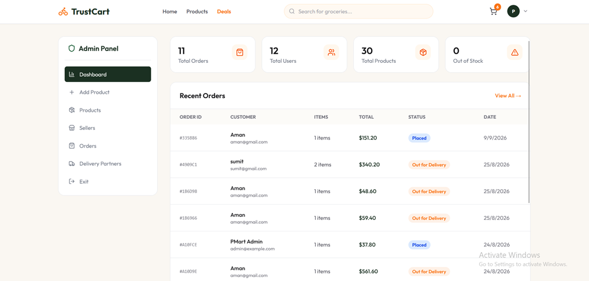

#### Seller Management

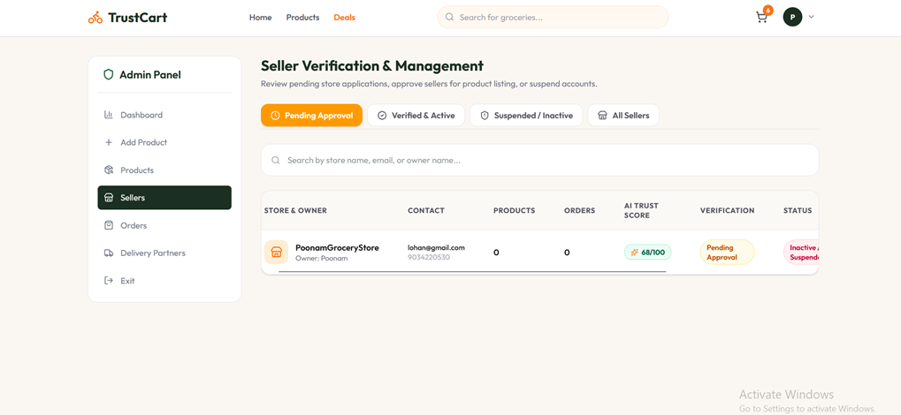

---

### Delivery Interface

#### Delivery Dashboard

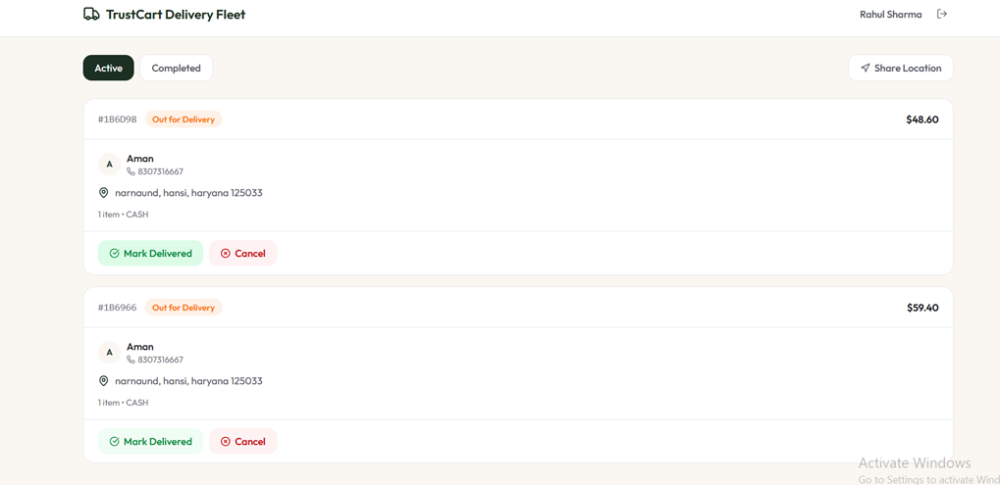

---

## Environment Variables

Create the required `.env` files for the frontend and backend and add the project credentials for services such as:

- MongoDB
- JWT
- Razorpay
- Cloudinary

> **Note:** Do not commit `.env` files or secret keys to GitHub.

---

## Security

- JWT-based authentication
- Role-based access control
- Passwords stored in hashed form
- Protected backend routes
- Secure handling of payment and user data
- Environment variables for sensitive credentials

---

## Future Improvements

- Improve the AI Trust Engine with more historical seller data
- Add more detailed analytics for sellers and admins
- Improve delivery tracking
- Add more automated trust and fraud detection features
- Improve scalability for a larger marketplace

---

## Project Team

**Pankhuri**  
**Poonam**  
**Prachee**

B.Tech Computer Science and Engineering  
Chitkara University

---

## License

This project was developed as an academic project.
